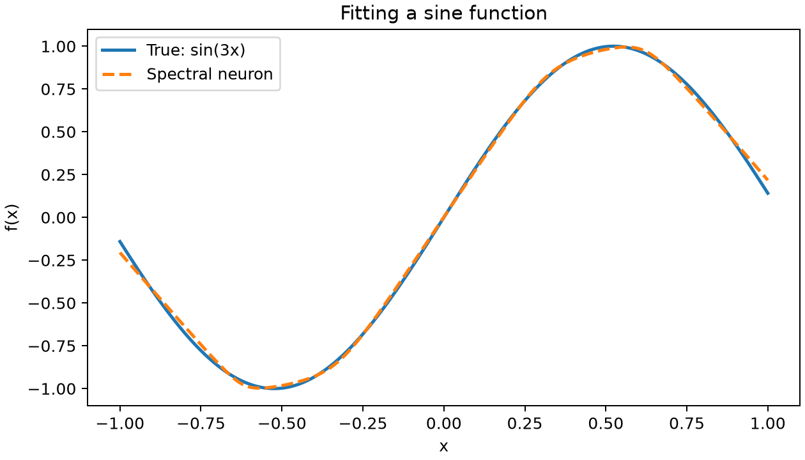

# Spectral neuron component

A nonlinear model for regression and binary classification, with a scikit-learn
interface. Its prediction is one eigenvalue of a learned, input-dependent
symmetric matrix.

Uses NumPy, SciPy, and scikit-learn. Requires Python 3.12 or newer.

## Quick start

From a checkout of this repository, install the dependencies with [uv](https://docs.astral.sh/uv/):

```bash
uv sync
```

Run this Python example in the project's environment (`uv run python`). It fits
a sine function from sampled input-output pairs:

```python
import numpy as np
from spectral_neuron import SpectralNeuron

rng = np.random.default_rng(7)
X = rng.uniform(-1, 1, size=(256, 1))
y = np.sin(3 * X[:, 0])

neuron = SpectralNeuron(random_state=7).fit(X, y)
print(neuron.predict([[0.2], [0.6]]))
```



Use it in a preprocessing pipeline:

```python
from sklearn.pipeline import make_pipeline
from sklearn.preprocessing import StandardScaler

model = make_pipeline(StandardScaler(), SpectralNeuron(random_state=7))
model.fit(X, y)
print(model.predict([[0.2], [0.6]]))
```

## Learn with the demos

- [Sine](demos/sine.py): fit a function and compare it with the true curve.
- [Spirals](demos/spirals.py): classify two spirals and plot the decision boundary.
- [California housing](demos/california_housing.py): compare with linear
  regression using test R², RMSE, and residual histograms.

These scripts use `# %%` cells, so you can run them cell by cell or as ordinary
Python. For example:

```bash
uv run --group demos python demos/sine.py
```

Replace `sine.py` with another demo name to run it. The housing demo downloads
its dataset on the first run.

## API at a glance

Choose the task with `loss`:

| `loss` | Task | `predict(X)` returns |
| --- | --- | --- |
| `"squared_error"` (default) | Least-squares regression | Predicted values |
| `"absolute_error"` | Absolute-error regression | Predicted values |
| `"log_loss"` | Binary classification | Class labels |

For classification, `predict_proba(X)` returns probabilities and
`decision_function(X)` returns logits. `transform(X)` always returns the raw
eigenvalue as a single feature column, including for classification.

By default, `max_iter=500` allows up to 500 epochs. Training can stop sooner
when parameter changes stay small; see [training and stopping](docs/explanation.md#stopping-and-prediction).

See `help(SpectralNeuron)` for parameters and fitted attributes, or read the
[estimator docstring](src/spectral_neuron/estimator.py).

## Understand the model

[How spectral neurons work](docs/explanation.md) explains eigenvalue selection,
initialization, and training. For the theory and experiments, see Alex Shtoff,
[*The Spectral Neuron*](https://arxiv.org/abs/2608.08003) (2026).

To run the tests: `uv run pytest`. Distributed under the [BSD 3-Clause license](LICENSE).
